# Computational RCS Analysis — Conventional vs Stealth Aircraft

First-principles Python framework for predicting the radar cross section (RCS) of aircraft geometries, comparing a conventional shape against a faceted stealth design. Built for the RVCE Avionics PBL.

## What it does

Given a triangulated aircraft mesh, the code computes monostatic and bistatic RCS across frequency, azimuth, and elevation by summing physical-optics and diffraction contributions over every facet and edge. It handles six built-in geometries (sphere, flat plate, conventional aircraft, faceted stealth aircraft, flying wing, chined-nose aircraft), applies radar-absorbing material (RAM) coatings, and produces the full set of plots needed to explain *why* a stealth shape reduces RCS rather than just showing that it does.

## Physics / solvers (`solvers.py`)

Four solvers, each building on the last:

- **`POAmplitudeSolver`** — Physical Optics. Integrates induced surface currents (`J = 2n̂ × H_inc`) over illuminated facets, using the standard PO far-field integral. This alone gets specular returns right but misses edge diffraction and multi-bounce.
- **`PTDSolver(POAmplitudeSolver)`** — adds Physical Theory of Diffraction, correcting the PO result with edge-diffraction terms (Michaeli/Ufimtsev-style edge waves) so leading/trailing edges and discontinuities scatter correctly.
- **`DoubleBounce(PTDSolver)`** — adds two-bounce ray tracing for corner reflectors (e.g. wing-fuselage junctions, inlet ducts) — the dominant RCS mechanism for many conventional aircraft features that PO+PTD alone underpredicts.
- **`TripleBounce(DoubleBounce)`** — extends to three-bounce paths for deeper cavity-like geometry (inlet ducts, weapon bays).

RAM modeling:
- **`SIBCMaterial`** — surface impedance boundary condition for lossy coatings, parameterized by conductivity and relative permeability.
- **`SalisburyScreen`** — single quarter-wave resistive absorber tuned to a center frequency `f0`.
- **`DallenbachLayer`** — single dielectric absorbing layer (thickness, εr, μr), the more general absorber model, evaluated against carbonyl iron, carbon foam, and ferrite tile parameter sets.

Validation: the sphere geometry is checked against the analytic **Mie series** (`scipy.special.spherical_jn/yn`) — this is the standard cross-check for any RCS solver since it's one of the few closed-form solutions available.

## Geometry (`geometries.py`)

Meshes are built procedurally (quads subdivided into triangles, welded at shared vertices) rather than imported from CAD:
- `sphere_mesh`, `flat_plate` — canonical validation shapes
- `conventional_aircraft` — fuselage + wings + tail, no shaping for RCS reduction
- `stealth_aircraft(sweep_deg, cant_deg, nose_length)` — faceted design with parameterized edge alignment and canted surfaces (the actual RCS-reduction mechanism: aligning edges to a small number of scatter directions and canting panels away from the radar)
- `flying_wing`, `chined_nose_aircraft` — additional low-observable geometries for comparison

## Other analysis modules

- `isar_imaging.py` — inverse SAR range-Doppler imaging from the wideband RCS response
- `wideband_impulse_response.py` — time-domain impulse response from frequency-swept RCS
- `sibc_comparison.py` / `sibc_convergence.py` — SIBC accuracy vs mesh density
- `stealth_optimizer.py` / `optimizer_sensitivity.py` — parameter sweep over sweep/cant angle to minimize RCS, with sensitivity analysis
- `advanced_study.py` / `advanced_convergence_study.py` / `triple_bounce_convergence.py` / `convergence_study.py` — mesh convergence studies confirming results are mesh-independent, not artifacts of facet count
- `main.py` — batch-generates every single-subject PNG used in the writeup, into `output_ppt/`
- `plot_style.py` — shared matplotlib styling

## Installation

```bash
pip install numpy scipy matplotlib
python main.py
```

Each script under `output_ppt/<NN>_<topic>/` is self-contained and can also be run individually, e.g. `python convergence_study.py`.

## Results

**Geometry (conventional vs stealth):**

<p float="left">
  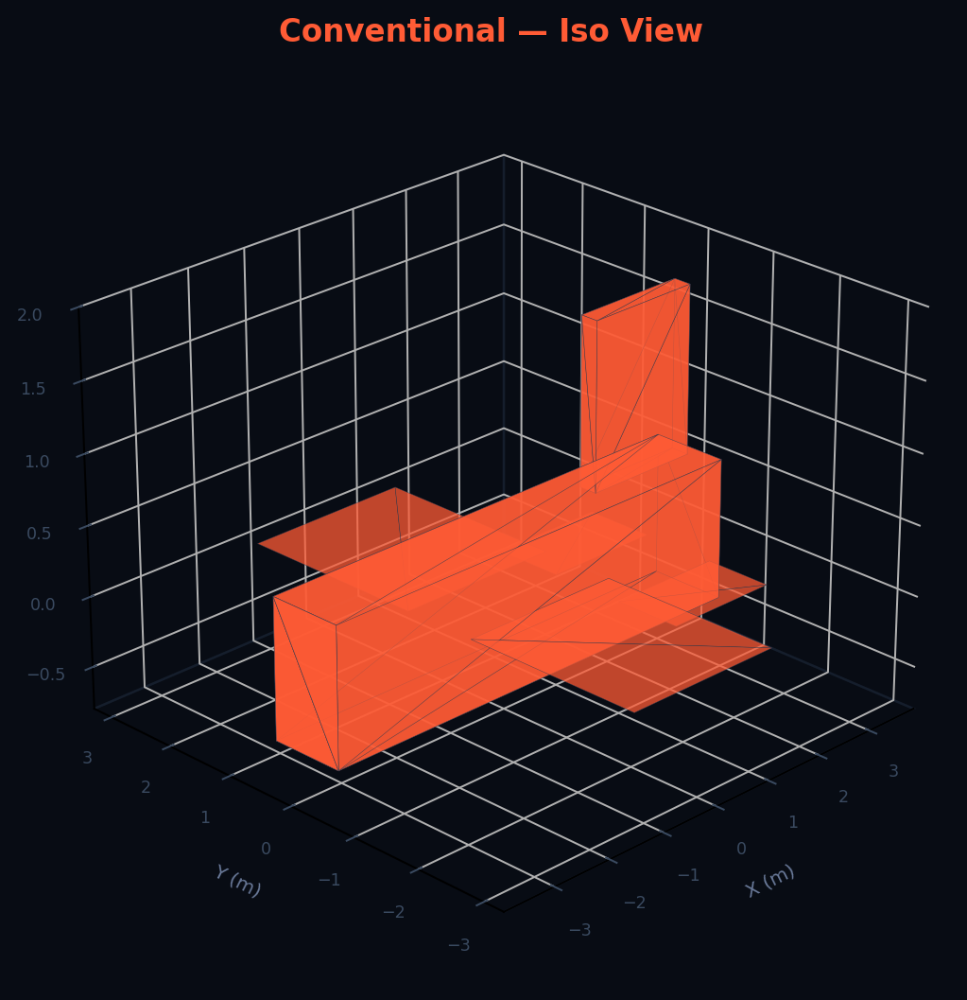
  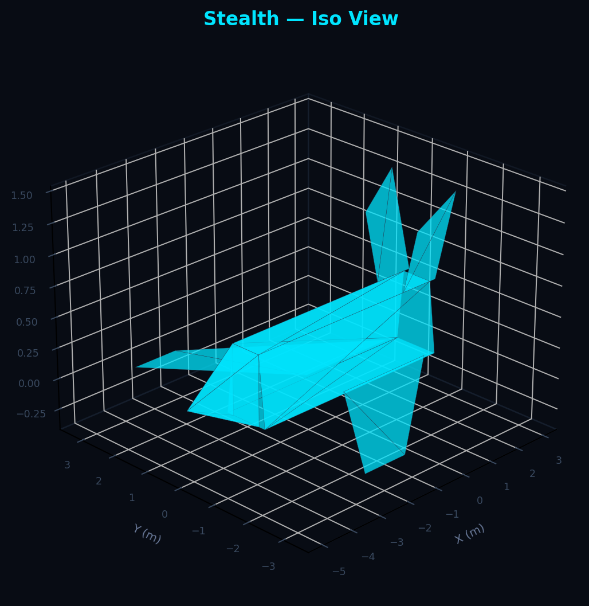
</p>

**RCS polar pattern, full physics (PO + PTD + double bounce):**

<p float="left">
  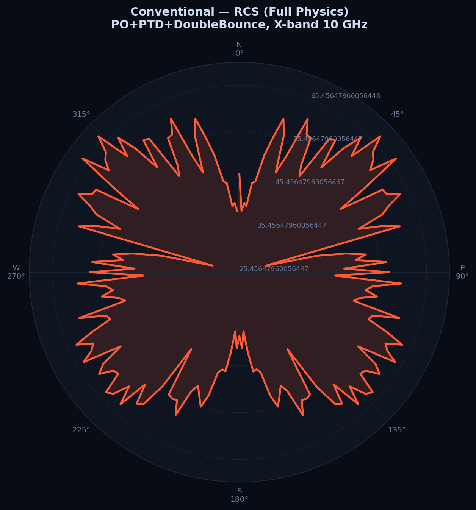
  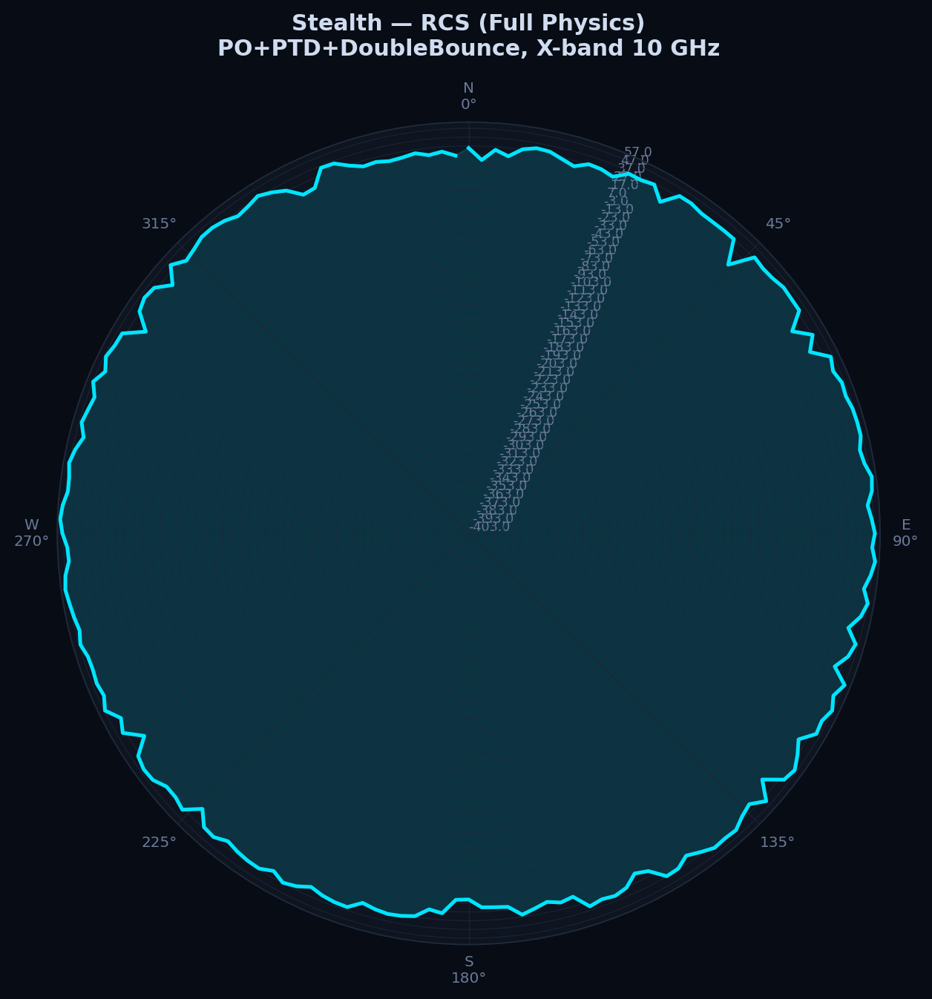
</p>

**Az/el RCS heatmap:**

<p float="left">
  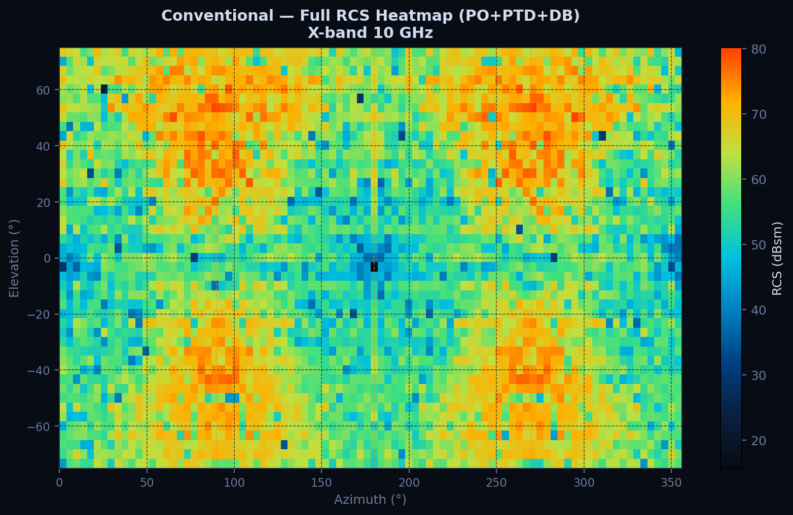
  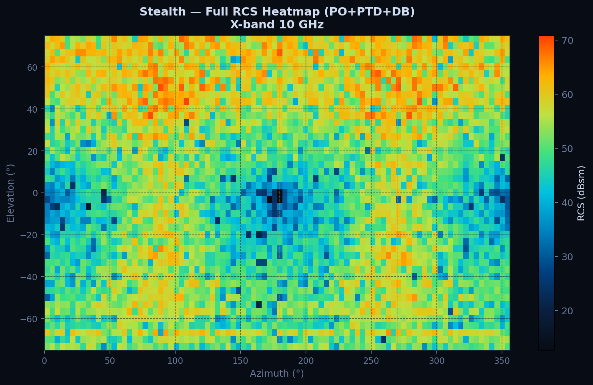
</p>

**RAM absorption (Salisbury / Dallenbach, multiple materials):**

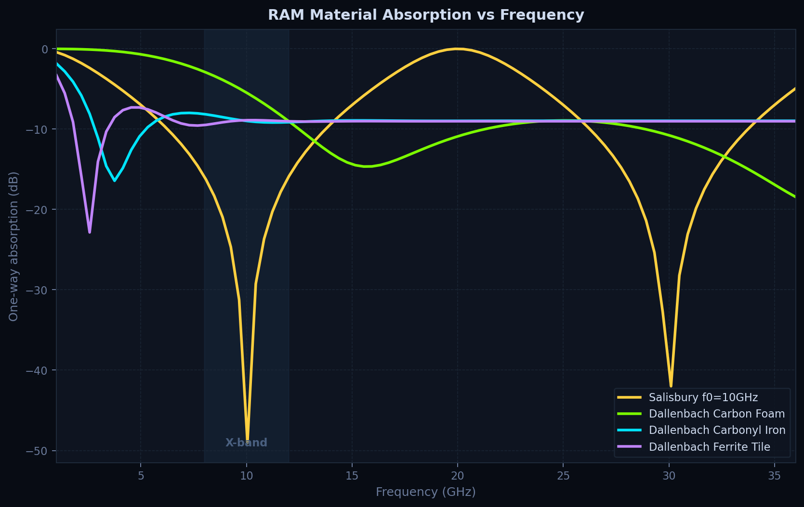

**Scattering mechanism breakdown** (how much of the return is PO-only vs edge diffraction vs double bounce):

<p float="left">
  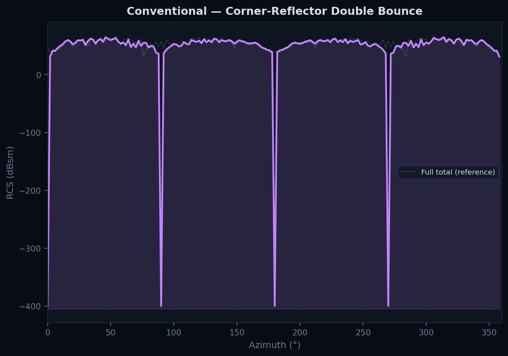
  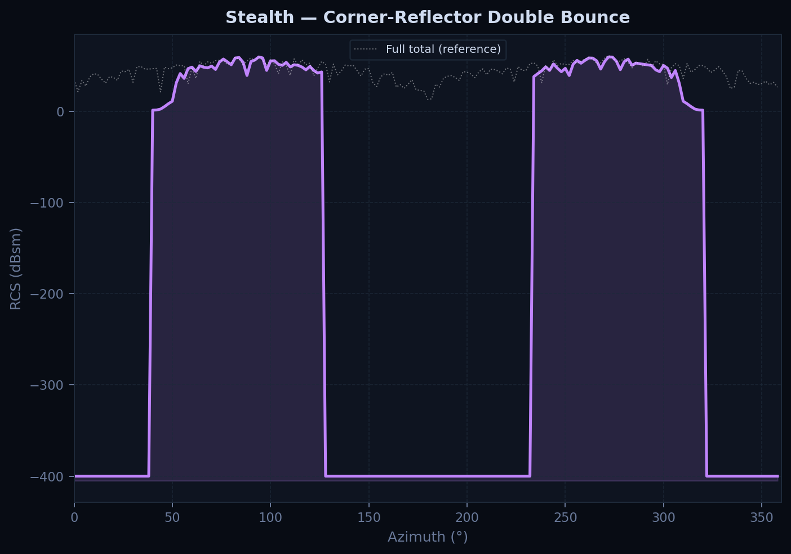
</p>

**Overlay comparison across all six geometries:**

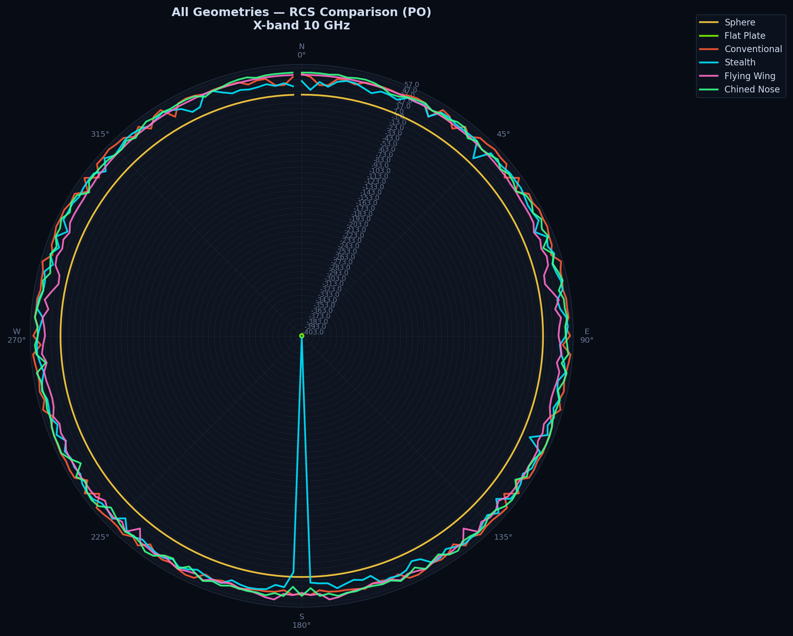
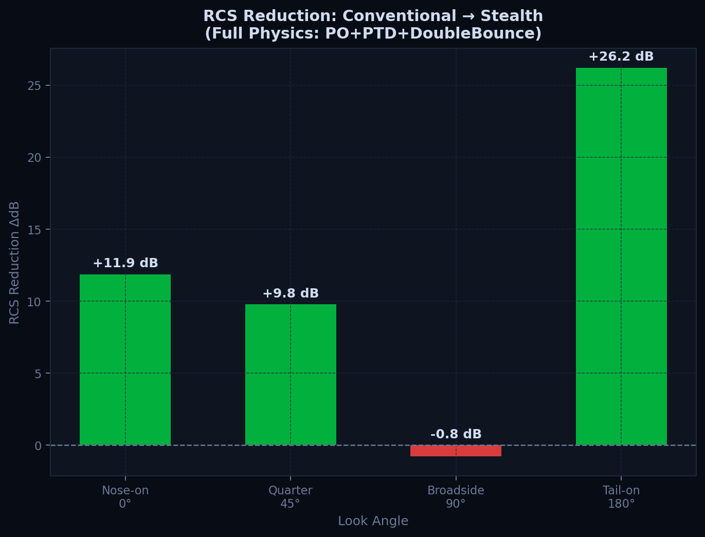

**Mesh convergence** (confirms results don't depend on facet count):

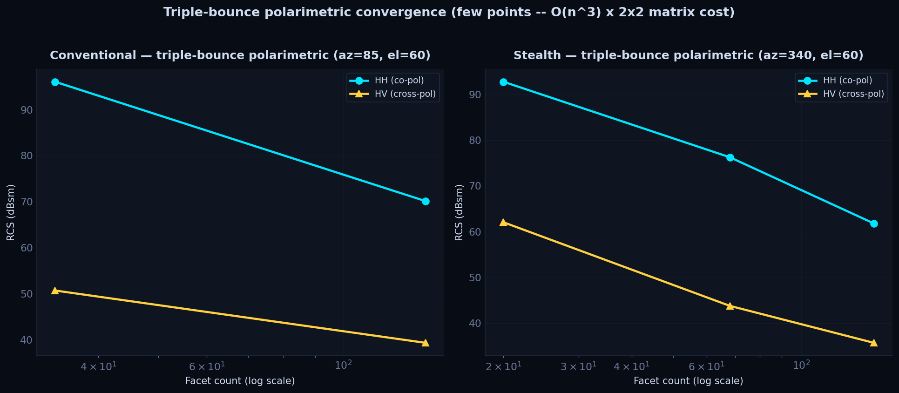

**ISAR range-Doppler image:**

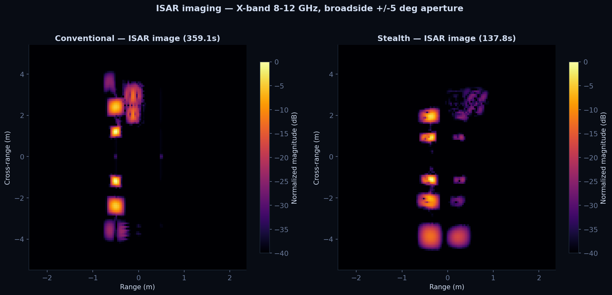

The rest of the generated figures (bistatic sweeps, polarimetric signatures, wideband frequency response, optimizer landscape) are under `output_ppt/` in the corresponding numbered folder.

## Limitations

- PO/PTD/multi-bounce ray methods are high-frequency asymptotic approximations — valid when the target is many wavelengths across. They don't capture resonance effects that show up at low frequency (Rayleigh/resonance regime), which is why the sphere validation against Mie is done specifically to bound where the approximation holds.
- Geometries are simplified parametric meshes, not real aircraft CAD — absolute RCS numbers are illustrative, not a prediction for any specific real airframe.
- RAM models (Salisbury, Dallenbach) use published material parameter sets, not measured samples.

## Write-up

Full technical writeup with the same figures and the derivations behind each solver: https://aboutkvs.vercel.app/rcs_prediction.html
